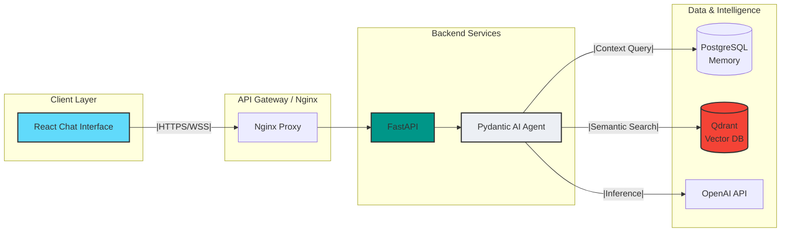
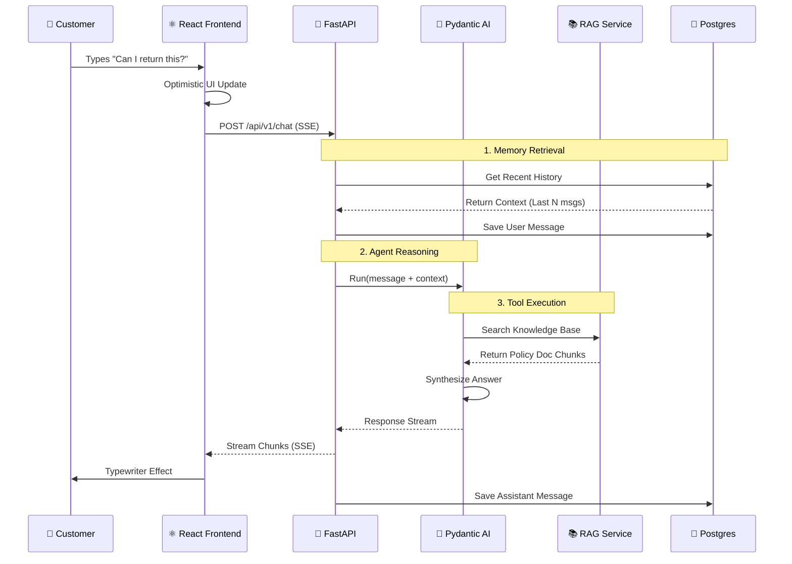

<div align="center">

  

  # MerliBot 🇸🇬

  ### Production-Ready AI Support Agent for Singapore SMBs

  [](https://opensource.org/licenses/MIT)
  [](https://www.python.org/downloads/release/python-3120/)
  [](https://react.dev/)
  [](https://fastapi.tiangolo.com/)
  [](https://www.pdpc.gov.sg/)

  **A hybrid-memory, context-aware AI agent designed to automate customer enquiries with RAG, strict type safety, and local-first data storage.**

  [Features](#-features) • [Architecture](#-architecture) • [Quick Start](#-quick-start) • [Development](#-development) • [Tech Stack](#-tech-stack)

</div>

---

## 🌟 Why MerliBot?

Running a business in Singapore is fast-paced. Your customer support should be too. MerliBot isn't just a chatbot wrapper; it is a sophisticated engineering solution tailored for the local market.

*   **🇸🇬 Singapore Native:** Trained to understand local nuances, Singlish context, and efficiency expectations.
*   **🧠 Hybrid Memory:** Combines **Long-term** (Postgres) and **Short-term** (Redis/Session) memory to remember customers across weeks, not just minutes.
*   **🔍 RAG-Powered:** Answers are grounded in *your* business documents (PDFs, Markdowns), not hallucinations.
*   **🔒 PDPA Aware:** Built with strict data governance. PII is masked, and data remains secure.
*   **🚀 Production Ready:** Includes Docker orchestration, security hardening (Rate Limiting), and automated RAG evaluation.

---

## 🏛️ Architecture

MerliBot utilizes a modern **Microservices** architecture orchestrated via Docker. It separates the "Brain" (Agent) from the "Face" (Frontend) and the "Library" (Vector DB).

### 1. High-Level System View


### 2. User Journey (Request Flow)


### 3. Module Interactions
```mermaid
graph TD
    Core[Core Agent Logic]
    
    Core -->|Dependency Inject| RAGTool[RAG Service]
    Core -->|Dependency Inject| OrderTool[Order Lookup]
    Core -->|Dependency Inject| EscalateTool[Escalation]
    
    RAGTool -->|Embeds Query| QdrantClient[Qdrant Client]
    RAGTool -->|Hybrid Search| BM25[Built-in BM25]
    
    Core -->|Stores Context| MemoryMgr[Memory Manager]
    MemoryMgr -->|ORM| PostgreSQL[SQLAlchemy Models]
    
    Style Core fill:#f9f,stroke:#333,stroke-width:4px
    Style RAGTool fill:#bbf,stroke:#333,stroke-width:2px
    Style MemoryMgr fill:#bfb,stroke:#333,stroke-width:2px
```

---

## 📁 File Hierarchy

A clean, modular structure ensuring maintainability and scalability.

```text
merlibot/
├── merlibot-backend/            # Python Backend (FastAPI)
│   ├── core/
│   │   ├── agent.py             # Pydantic AI Agent Definition & Tools
│   │   ├── config.py             # Settings & Secrets Management
│   │   └── database.py          # SQLAlchemy Models & Connection
│   ├── data/                    # Knowledge Base Source
│   │   └── company_policies.md  # Ingest this for RAG
│   ├── services/
│   │   ├── memory_service.py    # Conversation History Logic
│   │   └── rag_service.py       # LangChain + Qdrant Integration
│   ├── main.py                  # FastAPI App Entry Point
│   ├── eval.py                  # RAGAs Evaluation Script
│   ├── ingest_data.py           # Pipeline to load data into Vector DB
│   └── requirements.txt
│
├── merlibot-frontend/           # React Frontend (Vite)
│   ├── public/
│   ├── src/
│   │   ├── components/
│   │   │   ├── ChatInterface.tsx # Main Chat UI Container
│   │   │   ├── ChatInput.tsx     # Streaming Input Component
│   │   │   └── ui/               # Shadcn UI Primitives (Button, Card)
│   │   ├── hooks/
│   │   │   └── useChatStream.tsx # SSE Streaming Logic
│   │   ├── lib/
│   │   │   └── utils.ts          # Tailwind Class Merging
│   │   └── App.tsx
│   ├── Dockerfile                # Multi-stage Nginx Build
│   └── nginx.conf                # Reverse Proxy Configuration
│
├── docker-compose.yml           # Full Stack Orchestration
├── .env.example                 # Environment Template
└── README.md                    # This File
```

---

## 🚀 Quick Start

Get MerliBot running on your local machine in under 5 minutes.

### Prerequisites
- **Docker** & **Docker Compose**
- **OpenAI API Key** (Required for LLM and Embeddings)

### 1. Clone & Configure
```bash
git clone https://github.com/your-org/merlibot.git
cd merlibot
cp .env.example .env
```

### 2. Add API Key
Open `.env` and add your OpenAI Key:
```bash
OPENAI_API_KEY=sk-proj-...
```

### 3. Launch Infrastructure
This spins up Postgres, Qdrant, FastAPI, and the React Frontend.
```bash
docker-compose up --build
```

### 4. Ingest Knowledge (First Time Only)
Once the backend is up, ingest your business policies into the Vector DB.
```bash
docker-compose exec merlibot-backend python ingest_data.py
```

### 5. Access
- 🌐 **Frontend:** `http://localhost:3000`
- 📚 **API Docs:** `http://localhost:8000/docs` (Swagger UI)
- 🤖 **Agent Status:** `http://localhost:8000/health`

---

## ⚙️ Configuration

The behavior of MerliBot is controlled via environment variables defined in `.env`.

| Variable | Description | Default |
|----------|-------------|---------|
| `OPENAI_API_KEY` | Your OpenAI Secret Key | *Required* |
| `DATABASE_URL` | Postgres Connection String | `postgresql://...` |
| `AGENT_MODEL` | Primary LLM Model | `gpt-4o-mini` (Cost Effective) |
| `TEMPERATURE` | LLM Creativity (0.1 = Factual) | `0.1` |

---

## 🛠️ Development

### Adding Knowledge
Place your company documents (PDF, MD, TXT) into `merlibot-backend/data/` and run:
```bash
python ingest_data.py
```
The pipeline automatically chunks, embeds, and vectors your data into Qdrant.

### Running Evaluations
Ensure your RAG retrieval is accurate using the RAGAs framework:
```bash
python eval.py
```
This outputs a report on **Faithfulness**, **Answer Relevancy**, and **Context Precision**.

### Security Hardening
The system includes:
1. **Rate Limiting:** `slowapi` limits users to 10 requests/minute to prevent abuse.
2. **Input Sanitization:** Heuristic checks for prompt injection attempts (e.g., "Ignore previous instructions").
3. **CORS:** Strict origin whitelisting.

---

## 🧱 Tech Stack

### Frontend
*   **Framework:** React 18 with TypeScript
*   **Styling:** Tailwind CSS 4.0 (Shadcn UI Components)
*   **State:** Custom Hooks (`useChatStream`)
*   **Icons:** Lucide React

### Backend
*   **API:** FastAPI (Async, High Performance)
*   **AI Framework:** Pydantic AI (Type-safe Agents) + LangChain (RAG)
*   **LLM:** OpenAI (GPT-4o-mini for speed, GPT-4o for complex tasks)
*   **Embeddings:** `text-embedding-3-small`

### Data & Infrastructure
*   **Vector DB:** Qdrant (Rust-based, Hybrid Search)
*   **Database:** PostgreSQL 16 (Memory/Logs)
*   **Cache:** Redis (Session Management)
*   **Containerization:** Docker & Docker Compose

---

## 🧠 Design Philosophy

MerliBot is built on the principle of **"Meticulous Reduction."**
We removed the complexity of building an agent from scratch and replaced it with a strictly typed, dependency-injected system using **Pydantic AI**. This ensures that the agent logic is testable, predictable, and scalable.

### Why Pydantic AI over standard LangChain Agents?
While LangChain is excellent for data retrieval (RAG), managing complex agent state and function calling can become messy. Pydantic AI provides:
1.  **Type Safety:** The return types of tools are strictly enforced.
2.  **Dependency Injection:** We can easily swap out `RAGService` for a mock during testing.
3.  **Cleaner Code:** Less boilerplate, more logic.

---

## 📜 License

Distributed under the MIT License. See `LICENSE` for more information.

---

## 🤝 Contributing

Contributions are welcome! Please adhere to the following:
1.  Write clean, typed Python/TypeScript.
2.  Update tests and documentation.
3.  Follow the existing directory structure.

---

<div align="center">

**Built with ❤️ in Singapore**

[⬆ Back to Top](#merlibot-)

</div>
