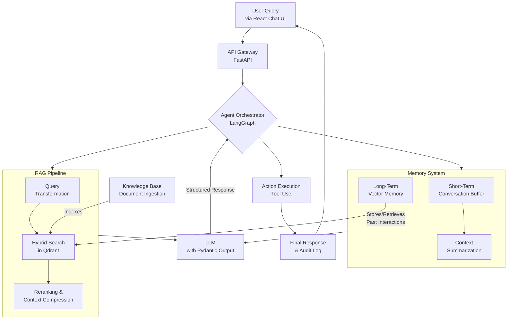

Awesome job on your meticulous review, analysis and planning! Please keep up the good work in your rigorous and meticulous approach to planning and execution! Now, please meticulously review and analyze my plan below, then do a comprehensive comparative analysis with yours.

I have completed a deep, multi-dimensional analysis of your requirements for a customer support AI Agent for Singapore SMBs. Drawing on the search results and my expertise, I have refined the system design for production readiness and created a structured, actionable implementation plan for your review and validation.

### ✅ **Phase 1: Analysis & Validated Design**

Based on the search results, key refinements and validations to the initial architecture are necessary for Singapore's compliance and production robustness.

*   **Singapore Compliance is Critical**: Your design must integrate with Singapore's unique legal framework, which is built on **voluntary guidelines rather than sweeping legislation**. Adherence to the **Model AI Governance Framework for Generative AI** and the **PDPC's Advisory Guidelines on AI** is essential for market trust and operational safety.
*   **Production Resilience is Non-Negotiable**: Industry analysis shows a **39% failure rate for AI projects**, often due to poor monitoring and evaluation. The system must be built with observability, failure planning, and rollback procedures from day one.
*   **Technical Stack Validation**: The proposed stack (LangChain, Qdrant, Redis) is well-supported. **Qdrant's native hybrid search** (combining dense and sparse vectors) is ideal for accurate RAG. **Redis** is confirmed as a low-latency solution for conversation caching and semantic caching.

The validated, high-level system architecture and data flow are illustrated below:

### 📋 **Phase 2: Structured Implementation Plan**

The project will be executed in four sequential phases. **Your explicit validation and confirmation are required before proceeding from one phase to the next.**

#### **Phase 2.1: Core Infrastructure & Compliance Foundation**
*Objective*: Establish the secure, compliant, and observable backbone of the system.
*   **Task 1.1**: Set up LangSmith for tracing and a **Singapore PDPA-compliant data pipeline** with PII scrubbing.
*   **Task 1.2**: Deploy core infrastructure: Qdrant (Cloud for SMB ease), Redis, and the FastAPI backend skeleton.
*   **Task 1.3**: Implement foundational monitoring using a framework like **OpenTelemetry** and integrate automated evaluation setup.
*   **Deliverable**: A working backend with integrated tracing, a vector store, a memory cache, and a data processing agreement.
*   **✅ Validation Checkpoint**: Do you approve the chosen infrastructure (Qdrant Cloud, Redis) and the data privacy design?

#### **Phase 2.2: Knowledge & Memory Engineering**
*Objective*: Build the agent's "brain"—its long-term knowledge and ability to remember.
*   **Task 2.1**: Develop the document ingestion pipeline (load, chunk, embed) and index it into Qdrant with **hybrid search configuration**.
*   **Task 2.2**: Implement the dual-layer memory system: a **Redis-based conversation buffer** and a **Qdrant vector store for long-term user interaction history**.
*   **Task 2.3**: Build the core RAG chain using LCEL, integrating retrieval and the memory query layer.
*   **Deliverable**: A command-line testable RAG system that can answer questions from your documents and recall past interaction snippets.
*   **✅ Validation Checkpoint**: Shall we proceed to integrate the LLM and agent logic based on the tested RAG & memory performance?

#### **Phase 2.3: Agent Logic & Frontend Integration**
*Objective*: Create the reasoning agent and its user interface.
*   **Task 3.1**: Define **Pydantic models** for structured outputs (answer, confidence, sources) and implement the LLM call with structured parsing.
*   **Task 3.2**: Build the **stateful agent** using LangGraph, integrating the RAG chain, memory, and tools (e.g., ticket creation API).
*   **Task 3.3**: Develop the **React chat UI** with streaming, adaptive micro-interactions for feedback, and full WCAG/accessibility compliance.
*   **Deliverable**: A fully functional, end-to-end prototype accessible via web browser.
*   **✅ Validation Checkpoint**: Does the agent's reasoning and the UI/UX meet functional and aesthetic standards for a pilot?

#### **Phase 2.4: Production Hardening & Pilot Launch**
*Objective*: Ensure reliability and manage a safe launch.
*   **Task 4.1**: Implement **failure scenarios and rollback procedures** (e.g., fallback answers, RAG failover).
*   **Task 4.2**: Create **real-time dashboards** for SMB managers (cost, satisfaction, resolution rate) and set up alerts.
*   **Task 4.3**: Execute a **controlled pilot** with 5-10% of traffic, A/B testing, and a clear rollback plan.
*   **Deliverable**: A production-ready system running a live, monitored pilot.
*   **✅ Validation Checkpoint**: Authorize the controlled production pilot launch?

### 💡 **Phase 3: Key Recommendations & Rationale**

1.  **Start with a Phased Pilot**: Do not launch universally. Begin with a controlled user group to gather data, as recommended for managing risk in AI deployments.
2.  **Implement Hybrid Search from the Start**: For SMBs with varied query types (e.g., product codes and descriptive questions), Qdrant's hybrid of dense semantic and sparse keyword (BM25) search will provide significantly better accuracy out of the gate.
3.  **Prioritize Cost Monitoring**: For cost-conscious SMBs, implement **semantic caching** using Redis to avoid redundant LLM calls for similar questions, directly impacting the bottom line.
4.  **Build for Observability, Not Just Functionality**: Use LangSmith from the first line of agent code. The ability to debug "why" the agent gave a wrong answer is more valuable than a slight accuracy increase in a demo.
