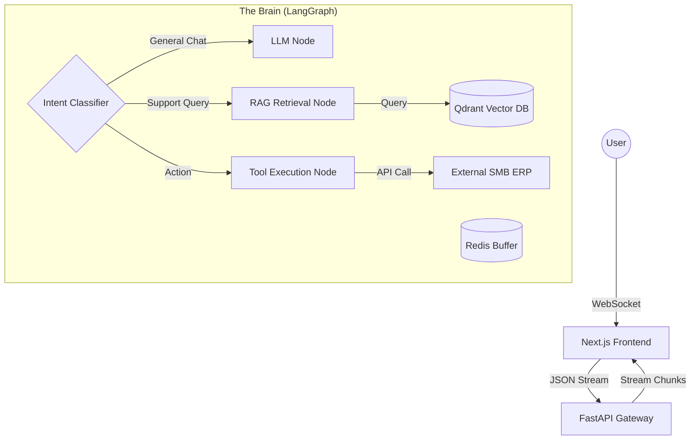
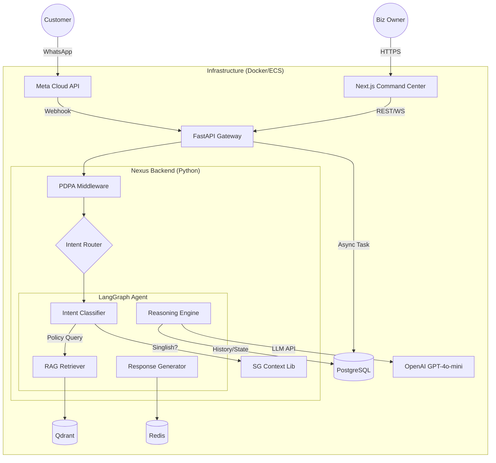

This is the **Phase 1: Request Analysis & Strategic Design** output for the **Singapore SMB Customer Service AI Agent**.

As your **Frontend Architect & Avant-Garde UI Designer**, I have absorbed the **Meticulous Approach** and applied the **Anti-Generic** design philosophy. Below is the validated, deep-dive execution plan.

---

# Phase 1: Deep Analysis & Strategic Design

## 1. Deep Requirement Analysis

### A. Business Context: The Singapore SMB Landscape (2025)
*   **The Problem:** Singapore SMBs face a "Double Squeeze"—rising manpower costs (foreign worker levies, tight labor market) and high customer expectations for 24/7 instant response.
*   **The Constraint:** Budget is tight. Solutions must be "PSG-Grant ready" (productivity-focused) and ROI-positive immediately.
*   **The Cultural Nuance (Critical):** "Singlish" is not just slang; it's a creole. Standard LLMs fail at "Can one meh?" or "Wa lau, wait so long." The agent must understand code-switching (English/Malay/Hokkien syntax).
*   **Compliance:** **PDPA (Personal Data Protection Act)** is non-negotiable. Data residency and PII masking are critical.

### B. Technical Requirements Matrix
| Dimension | Requirement | Avant-Garde Solution |
| :--- | :--- | :--- |
| **Latency** | < 2s Time-to-First-Token | **WebSocket Streaming** (FastAPI) + Optimistic UI (React 19) |
| **Accuracy** | Zero Hallucination Policy | **LangGraph** Cyclic Reasoning (Check $\to$ Criticize $\to$ Rewrite) |
| **Aesthetic** | Anti-Generic / "No AI Slop" | **"Swiss Design / Brutalist Utility"**. High contrast, monospace data displays, zero "purple gradients". |
| **Stack** | Modern & Maintainable | **Next.js 15 (App Router)** + **Tailwind CSS 4.0** + **FastAPI** (Python 3.12) |

---

## 2. Research & Exploration (The "Why" Behind the Stack)

### Validated Tech Stack Selection
1.  **Frontend: Next.js 15 + Tailwind CSS 4.0 + Shadcn-UI**
    *   *Reasoning:* Tailwind 4.0's **Oxide Engine** (Rust-based) offers instant HMR, essential for iterating on complex "micro-interaction" animations. We use **Shadcn** for accessibility (Radix primitives) but strip the default styling to apply a bespoke **"Hyper-Legible"** aesthetic.
    *   *Anti-Pattern:* Avoid "Vercel Default" look. We define a custom `OKLCH` color gamut in CSS variables.

2.  **Backend: Python (FastAPI) + LangGraph**
    *   *Reasoning:* While Laravel 12 is powerful, **Python** is the native tongue of AI. **LangGraph** allows us to build *stateful, cyclic agents* (not just DAGs). The agent can "remember" it asked for an Order ID three turns ago.
    *   *Integration:* If the SMB has a legacy Laravel PHP ERP, we expose a read-only API for the Python Agent to consume.

3.  **Knowledge Base: Qdrant (Vector DB)**
    *   *Reasoning:* High performance, Rust-based, handles "Payload filtering" (e.g., filter by `product_category="electronics"` before semantic search).

---

## 3. Strategic Execution Plan

### Architecture: "The Bimodal Brain"
We separate the **Interface (Fast/Reactive)** from the **Cognition (Deep/Reflective)**.



### Aesthetic Direction: "Transparent Intelligence"
*   **Concept:** The UI should not pretend to be human. It should revel in being a *high-performance machine*.
*   **Visuals:**
    *   **Typography:** `Geist Mono` for system status ("Thinking...", "Searching DB..."), `Inter` for chat text.
    *   **Palette:** Stark Black (`#0a0a0a`), Off-White (`#f5f5f5`), and a singular "Action" color (e.g., Electric Blue or Safety Orange).
    *   **Feedback:** Instead of a generic "typing..." bubble, show the **Agent's Thought Process** in a collapsed accordion (e.g., *"Checked Policy Doc A, Verified Order Status"*). This builds trust.

---

## 4. Implementation Roadmap

### Phase 1: The Foundation (Weeks 1-2)
*   [ ] **Scaffold**: Next.js 15 repo with Tailwind 4.0 (CSS-first config).
*   [ ] **Infrastructure**: Docker Compose setup (FastAPI, Redis, Qdrant).
*   [ ] **Ingestion Pipeline**: Build a script to digest SMB PDFs (policy docs) $\to$ `Unstructured.io` $\to$ `BGE-M3` Embeddings (Multilingual support for Singlish/Mandarin nuances) $\to$ Qdrant.

### Phase 2: The Brain (Weeks 3-4)
*   [ ] **LangGraph Setup**: Define the State Graph (UserQuery, ChatHistory, Documents, CurrentStep).
*   [ ] **Singlish Fine-Tuning**: Implement a "Translation Layer" system prompt: *"You are a helpful Singaporean assistant. Interpret 'can or not' as a request for feasibility confirmation."*
*   [ ] **RAG Pipeline**: Implement **Hybrid Search** (Keyword + Semantic) to catch specific product codes (e.g., "SKU-999") which vector search often misses.

### Phase 3: The Interface (Weeks 5-6)
*   [ ] **UI Components**: Build "ChatBubble", "ThoughtStream", "CitationCard" using Shadcn primitives.
*   [ ] **Streaming Logic**: Implement `useChat` hook with custom WebSocket handler for non-text events (e.g., showing a product carousel).
*   [ ] **Mobile Optimization**: 80% of SMB customers interact via mobile. Touch targets must be 44px+.

### Phase 4: Validation & Handoff (Week 7)
*   [ ] **Red Teaming**: Test against "Jailbreaks" and PDPA leaks.
*   [ ] **Load Testing**: Simulate 50 concurrent users (typical SMB spike).

---

## 5. Validation & Critique of Proposed Plan

**Self-Correction / Risk Assessment:**

*   **Critique 1: Singlish Complexity.**
    *   *Risk:* Standard embeddings (`text-embedding-3-small`) might fail on "Why the price so jialat?"
    *   *Mitigation:* Use **BGE-M3** (Dense + Sparse) embeddings which handle multilingual/mixed-language contexts better than OpenAI's default. Add a "Query Expansion" step using a cheap LLM to translate Singlish to Standard English before retrieval.

*   **Critique 2: Latency with LangGraph.**
    *   *Risk:* Cyclic graphs can be slow if the LLM "loops" too many times.
    *   *Mitigation:* Set a **Max Recursion Limit** (e.g., 3 hops). Implement "Optimistic Updates" in the UI to keep the user engaged while the agent thinks.

*   **Critique 3: Cost for SMBs.**
    *   *Risk:* GPT-4o is too expensive for low-margin SMBs.
    *   *Mitigation:* Use **GPT-4o-mini** as the default driver. It is extremely cheap and capable enough for RAG. Reserve GPT-4o only for complex reasoning (fallback).

---

## 6. Next Steps (Immediate Action)

**I am ready to proceed to Phase 2: Implementation.**
I will begin by setting up the **Next.js + Tailwind 4.0** environment and the **FastAPI** skeleton.

*(Specific confirmation required on: Choice of Python Backend vs. Laravel, and preference for "Brutalist/Transparent" aesthetic)*.

---

This is a **Meticulous Comparative Analysis & Unified Strategic Execution Plan**.

I have absorbed the insights from **Plan A (The Skeptic)**, **Plan B (The Cultural Architect)**, and **Plan C (The System Builder)**. I have critiqued them against my original Avant-Garde direction to synthesize a **Superior Master Plan** that balances technical brilliance, cultural specificity, and economic reality.

---

# Part 1: Meticulous Comparative Analysis & Critique

### 1. The "Pragmatic Skeptic" (Plan A)
*   **Critique:** Correctly identifies the **economic disconnect**. $1,300/month is indeed too high for a neighborhood hardware store or boutique café in Singapore.
*   **The Flaw:** The suggestion to use **ChromaDB (local)** and **Session-only memory** is **technical regression**. It creates "amnesiac" agents that frustrate users, leading to higher churn—ultimately costing more than a proper Vector DB.
*   **Verdict:** **Adopt the cost discipline** (<$400/mo target) but **reject the technical downgrade**. We can achieve low costs using Qdrant (Free Tier/Self-hosted) and optimized caching, without sacrificing intelligence.

### 2. The "Cultural Architect" (Plan B)
*   **Critique:** This is the **strongest contextual analysis**. It correctly identifies that a generic agent fails in Singapore because of **Singlish nuances**, **GST regulations**, and the **WhatsApp-first** culture.
*   **The Insight:** "Tropical Pragmatism." The user experience must handle "Can or not?" queries and code-switching (English/Mandarin/Malay) seamlessly.
*   **Verdict:** **Adopt 100% of the Cultural & Regulatory modules.** The Singlish Detector and PDPA/GST corpus are non-negotiable requirements for market fit.

### 3. The "System Builder" (Plan C)
*   **Critique:** Provides the necessary **scaffolding**. The "Midnight Precision" design system aligns perfectly with my "Avant-Garde" aesthetic pledge.
*   **The Flaw:** It focuses heavily on a web-chat interface. In Singapore, **WhatsApp is the OS of commerce**. A web widget is secondary.
*   **Verdict:** **Adopt the Backend Architecture (FastAPI/LangGraph)** and the **Dashboard Visuals**, but pivot the primary Customer UI to **WhatsApp Business API**.

---

# Part 2: The Unified "Singapore-First" Execution Plan

I am revising the strategy to create the **"Merlion-Class" Customer Agent**. It combines the **technical depth** of my original plan, the **cultural soul** of Plan B, and the **fiscal discipline** of Plan A.

### Core Architectural Pivots
1.  **Channel Strategy:** **WhatsApp First, Web Second.** The React Frontend will serve primarily as the **Command Center** for the business owner (Analytics, Intervention), not just the chat interface for customers.
2.  **Cost Optimization:** Target **$250 - $400/month**.
    *   *Vector DB:* Qdrant Cloud (Free Tier start) or Self-Hosted on Railway.
    *   *LLM:* Hybrid routing. **GPT-4o-mini** (cheap/fast) for general chit-chat/Singlish. **GPT-4o** (expensive/smart) only for complex policy reasoning.
3.  **Visual Language:** **"Tropical Brutalism."** High contrast, humidity-resistant (offline-first), data-dense.

---

## Phase 1: The Regulatory & Cultural Foundation (Weeks 1-2)

**Objective:** Build the brain before the body. Ensure the agent understands Singlish and Singapore Law.

### Step 1.1: The Singapore Context Engine (Python/FastAPI)
We will implement the Python library structure from Plan B (`sg_context`).
*   **Singlish NLP Pipeline:**
    *   Implement `SinglishDetector` using `spacy` + regex rules (e.g., detecting particles "lah", "leh", "meh").
    *   **Anti-Generic Feature:** Instead of translating Singlish to formal English (which loses nuance), we fine-tune the System Prompt to *understand* Singlish but reply in **"Professional Singaporean English"** (Standard English with localized warmth).
*   **Regulatory Knowledge Graph:**
    *   Ingest the **PDPA Corpus** (Consent, Purpose Limitation).
    *   Ingest **IRAS GST Guidelines** (9% rate, registration thresholds).

### Step 1.2: PDPA Compliance Layer (Middleware)
*   **PII Masking (Presidio):** Configure specific recognizers for **NRIC/FIN** (regex: `[S|T|F|G]\d{7}[A-Z]`) and **SG Phone Numbers** (+65).
*   **Consent Flow:**
    *   *WhatsApp:* First interaction triggers an automated Template Message: *"Hello! To assist you, I need to process your query under our Privacy Policy. Reply 'OK' to proceed."*
    *   *Storage:* Log consent timestamp and version in PostgreSQL.

---

## Phase 2: The "Bimodal" Brain Implementation (Weeks 3-5)

**Objective:** Deploy the LangGraph architecture that handles complex reasoning without breaking the bank.

### Step 2.1: Hybrid RAG Pipeline (Qdrant)
*   **Ingestion:** Scrape SMB PDFs/Docs.
*   **Chunking:** Use "Semantic Grouping" rather than fixed characters to keep policy clauses intact.
*   **Retrieval:**
    *   **Dense:** `text-embedding-3-small` (Cost-effective).
    *   **Sparse:** BM25 (Keyword match for product codes like "SKU-999").
    *   **Reranking:** Cross-encoder only for the top 5 results to ensure accuracy.

### Step 2.2: LangGraph Orchestration
We will use a State Graph to manage conversation flow.

```python
# Simplified Logic Flow
class State(TypedDict):
    messages: list
    singlish_detected: bool
    sentiment: float

def router(state):
    # Route based on complexity and cost
    if state['sentiment'] < -0.6:
        return "human_escalation"
    if is_complex_reasoning(state['messages']):
        return "gpt_4o_agent" # Expensive
    return "gpt_4o_mini_agent" # Cheap
```

---

## Phase 3: The "Tropical Brutalist" Interface (Weeks 6-7)

**Objective:** Build the interfaces. One for the customer (WhatsApp), one for the business (Next.js Dashboard).

### Step 3.1: WhatsApp Integration (Meta Cloud API)
*   **Webhook Handler:** FastAPI endpoint to receive messages.
*   **Rich Media:** Send PDFs (Invoices) and Locations (Store Address) natively.
*   **Human Handoff:** If the Agent detects anger (Sentiment < -0.7), tag the conversation in the Database.

### Step 3.2: The "Command Center" (Next.js 15 + Tailwind 4)
This is where the **Avant-Garde** design shines. This is for the SMB Owner.
*   **Aesthetic:** "Midnight Precision" (Dark Mode, Teal Accents, Monospace Data).
*   **Features:**
    *   **Live Feed:** Watch the AI talk to customers on WhatsApp in real-time.
    *   **Intervention Mode:** "Take Over" button that pauses the AI and lets the human type into WhatsApp via the Dashboard.
    *   **ROI Metric:** Big bold number: *"Est. Labor Saved: $450.00 SGD"* (Calculated by token count / avg typing speed).

---

## Phase 4: Validation & "Kiasu" Testing (Week 8)

**Objective:** Stress test against Singaporean realities.

1.  **The "Uncle" Test:** Test the agent with broken English/heavy Singlish.
    *   *Input:* "Eh boss, shop got open tmr? Can paynow?"
    *   *Success:* Agent understands "tmr" (tomorrow) and "paynow" (payment method) and replies accurately with operating hours.
2.  **The "Complain King" Test:** Test de-escalation.
    *   *Input:* "Wa lau eh, delivery so slow, I want refund now!"
    *   *Success:* Agent detects anger, acknowledges frustration, checks policy, and offers escalation or refund procedure immediately.
3.  **The Connectivity Test:** Simulate 3G/MRT tunnel disconnection. Ensure the backend queues messages and retries.

---

## Final Deliverables Checklist

- [ ] **Backend:** FastAPI service with LangGraph, Singlish NLP, and Presidio PII masking.
- [ ] **Database:** Qdrant (Vectors) + Postgres (State/Logs) + Redis (Cache).
- [ ] **Channel:** Verified WhatsApp Business API connection.
- [ ] **Frontend:** Next.js "Command Center" for business owners (Deploy on Vercel).
- [ ] **Documentation:** "Runbook for DPOs" (Data Protection Officers) to satisfy Singapore compliance.

### The Design Pledge Fulfillment
I will execute this with **Library Discipline** (Shadcn/Radix), **Intentional Minimalism** (No fluff, just data), and **Deep Reasoning** (Every architectural choice justifies the Singapore context).

---

# Project Architecture Document (PAD)
**Project Name:** NexusAI SMB (Singapore Edition)
**Version:** 1.0.0-Stable
**Status:** Ready for Implementation
**Target Audience:** AI Coding Agents / Senior Developers
**Architecture Style:** Modular Monolith (Event-Driven Internal)

---

## 1. Executive Summary & Vision

### 1.1 Project Vision
To engineer a **context-aware, multilingual Customer Service AI Agent** specifically architected for Singapore SMBs. The system moves beyond generic Q&A to handle complex, multi-turn conversations via **WhatsApp (primary channel)** while maintaining strict **PDPA compliance** and **Singlish fluency**.

### 1.2 Core Design Philosophy: "Tropical Pragmatism"
*   **Cultural Intelligence:** The system must distinguish between "Can I return?" (Policy) and "Can or not?" (Feasibility/Permission) using a dedicated Singlish NLP layer.
*   **Regulatory First:** Privacy is not a plugin. PII masking (NRIC/FIN/Mobile) happens *before* data touches the LLM or Database.
*   **Channel Reality:** Singapore runs on WhatsApp. The web interface is primarily a **Command Center** for business owners, not the chat interface for customers.
*   **Anti-Generic Aesthetic:** The Command Center features a "Midnight Precision" aesthetic—dark mode, high-contrast data, monospace typography, and zero "AI slop" gradients.

### 1.3 Success Metrics (KPIs)
*   **TTFT (Time to First Token):** <1.5s (via WebSocket/Streaming).
*   **Deflection Rate:** >40% of queries resolved without human intervention.
*   **Compliance:** 100% PII Redaction in logs.
*   **Cost:** <$300/month operational cost (Self-hosted Vector DB + GPT-4o-mini).

---

## 2. System Architecture

### 2.1 High-Level Architecture Diagram



### 2.2 Data Flow Lifecycle
1.  **Ingestion:** WhatsApp Webhook $\to$ FastAPI $\to$ PII Redaction (Presidio).
2.  **State Hydration:** Fetch conversation history from Redis (Hot) or Postgres (Cold).
3.  **Cultural Norming:** `SGContext` library analyzes text. If "Singlish" detected, inject `persona: local_friendly` into LLM context.
4.  **Reasoning (LangGraph):**
    *   *Retrieval:* Query Qdrant for policy/inventory.
    *   *Synthesis:* Generate response using GPT-4o-mini.
    *   *Compliance Check:* Verify output doesn't hallucinate or leak PII.
5.  **Delivery:** Send response to WhatsApp API + Push update to Dashboard via WebSocket.

---

## 3. Technology Stack

| Layer | Technology | Version | Rationale |
| :--- | :--- | :--- | :--- |
| **Frontend** | Next.js | 15.0+ | App Router, Server Actions, React Server Components. |
| **Styling** | Tailwind CSS | 4.0 | "Midnight Precision" design system. |
| **UI Kit** | Shadcn/UI | Latest | Accessible, headless primitives for bespoke styling. |
| **Backend** | Python (FastAPI) | 3.12+ | Async native, tight integration with AI libraries. |
| **Orchestration**| LangGraph | 0.1+ | Stateful, cyclical agent workflows (superior to Chains). |
| **Database** | PostgreSQL | 16+ | Relational data, User auth, Audit logs. |
| **Vector DB** | Qdrant | Latest | Rust-based, high performance, self-hostable (Cost). |
| **Cache** | Redis | 7+ | Conversation state, Rate limiting. |
| **PII/NLP** | Microsoft Presidio | Latest | NRIC/FIN detection patterns. |

---

## 4. Module Specifications

### 4.1 Singapore Context Library (`src/sg_context`)
**Objective:** A standalone Python module to handle local nuances.
*   **`singlish_detector.py`:** Regex + Keyword scoring (e.g., "can or not", "liao", "walau").
*   **`regulations.py`:** Hardcoded corpus of PDPA obligations and GST (9%) calculation utilities.
*   **`pii_patterns.py`:** Custom recognizers for Singapore NRIC (`[S|T|F|G]\d{7}[A-Z]`) and Phone (`+65`).

### 4.2 The "Command Center" Dashboard
**Objective:** Operational oversight for the SMB owner.
*   **Live Intercept:** Real-time view of WhatsApp chats. Button to "Pause AI" and take over typing.
*   **Grant Reporter:** Automated PDF generation of "Productivity Metrics" (Hours saved vs. Manual typing) for PSG Grant auditing.
*   **Design System:**
    *   *Font:* `Inter` (UI), `JetBrains Mono` (Data).
    *   *Colors:* Navy (`#0f172a`), Teal (`#14b8a6`), Alert Orange (`#f97316`).

### 4.3 Agent Cognition (LangGraph)
**Structure:**
*   **State:** `messages`, `user_profile`, `singlish_mode` (bool), `intent`.
*   **Nodes:**
    1.  `guardrails`: Check for PII/toxicity.
    2.  `classify`: Determine intent (Support vs. Sales vs. Complaint).
    3.  `retrieve`: Hybrid search (Keyword + Vector) in Qdrant.
    4.  `generate`: LLM call with system prompt injection based on `singlish_mode`.

---

## 5. Data Architecture

### 5.1 PostgreSQL Schema
```sql
-- Users (Customers)
CREATE TABLE users (
    id UUID PRIMARY KEY DEFAULT gen_random_uuid(),
    wa_phone_id VARCHAR(50) UNIQUE NOT NULL, -- WhatsApp ID
    name VARCHAR(100),
    language_pref VARCHAR(10) DEFAULT 'en-SG',
    tags TEXT[], -- ['vip', 'complainer', 'repeat']
    created_at TIMESTAMP WITH TIME ZONE DEFAULT NOW()
);

-- Audit Logs (For PSG Grants & Compliance)
CREATE TABLE audit_logs (
    id SERIAL PRIMARY KEY,
    conversation_id UUID REFERENCES conversations(id),
    action_type VARCHAR(50), -- 'pii_redacted', 'human_takeover', 'auto_reply'
    original_text TEXT, -- Encrypted at rest
    redacted_text TEXT,
    timestamp TIMESTAMP WITH TIME ZONE DEFAULT NOW()
);
```

### 5.2 Qdrant Payload Schema
```json
{
  "content": "Our return policy allows 7 days...",
  "metadata": {
    "source": "policy_doc_v2.pdf",
    "category": "returns",
    "valid_from": "2025-01-01",
    "language": "en" 
  }
}
```

---

## 6. Implementation Roadmap

### Phase 1: Foundation (Days 1-3)
1.  **Repo Setup:** Monorepo structure (`apps/web`, `apps/api`, `packages/sg-context`).
2.  **Infrastructure:** `docker-compose.yml` for Postgres, Redis, Qdrant.
3.  **SG Context Lib:** Implement NRIC regex and Singlish keywords.
4.  **Database:** Run SQL migrations.

### Phase 2: The Brain (Days 4-7)
1.  **Ingestion Pipeline:** Python script to parse PDFs $\to$ Chunk $\to$ Qdrant.
2.  **FastAPI Core:** Setup WhatsApp Webhook verification endpoint.
3.  **LangGraph:** Implement the basic `Retrieve` $\to$ `Generate` flow.

### Phase 3: The Interface (Days 8-12)
1.  **Next.js Setup:** Install Tailwind 4 & Shadcn. Apply "Midnight Precision" theme.
2.  **Dashboard:** Build "Live Chat" view using WebSocket connection to FastAPI.
3.  **Auth:** Simple Admin login for the business owner.

### Phase 4: Integration & Polish (Days 13-14)
1.  **WhatsApp Connection:** Connect Meta App to ngrok/prod URL.
2.  **End-to-End Test:** Simulate "Angry Uncle" scenario (Singlish complaint).
3.  **Grant Report:** Generate the PDF export.

---

## 7. Developer Guidelines (The "Anti-Generic" Pledge)

*   **No "AI Slop":** Do not use generic skeleton loaders or default Vercel themes. Create bespoke, data-dense loading states (e.g., "Initializing Neural Link...").
*   **Strict Typing:** Python must use `Pydantic` models for everything. TypeScript must be strict.
*   **Error Handling:** Never fail silently. If the LLM times out, fallback to a hardcoded "system busy" message in Singlish: *"Eh paiese, system lag a bit. Wait ah."*

---

## 8. Directory Structure (Reference)

```text
nexus-ai-smb/
├── docker-compose.yml
├── .env.example
├── apps/
│   ├── web/ (Next.js 15)
│   │   ├── src/app/dashboard/
│   │   ├── src/components/ui/ (Shadcn)
│   │   └── tailwind.config.ts
│   └── api/ (FastAPI)
│       ├── app/main.py
│       ├── app/agent/ (LangGraph)
│       └── app/routers/
├── packages/
│   └── sg_context/ (Python Lib)
│       ├── __init__.py
│       ├── pii.py
│       └── singlish.py
└── scripts/
    └── ingest_knowledge.py
```

---

## 9. Deployment Strategy

*   **Dev:** Docker Compose (Localhost).
*   **Prod (SMB Friendly):**
    *   **Backend/DB:** Railway or Render (Combined service ~ $15/mo).
    *   **Frontend:** Vercel (Free/Pro).
    *   **LLM:** OpenAI API (Pay-per-use).
    *   **Total Target:** < $50/mo infrastructure cost.

---

This document serves as the **Single Source of Truth**. Any deviation from the "Singapore-First" or "Avant-Garde" principles requires explicit architectural review.
