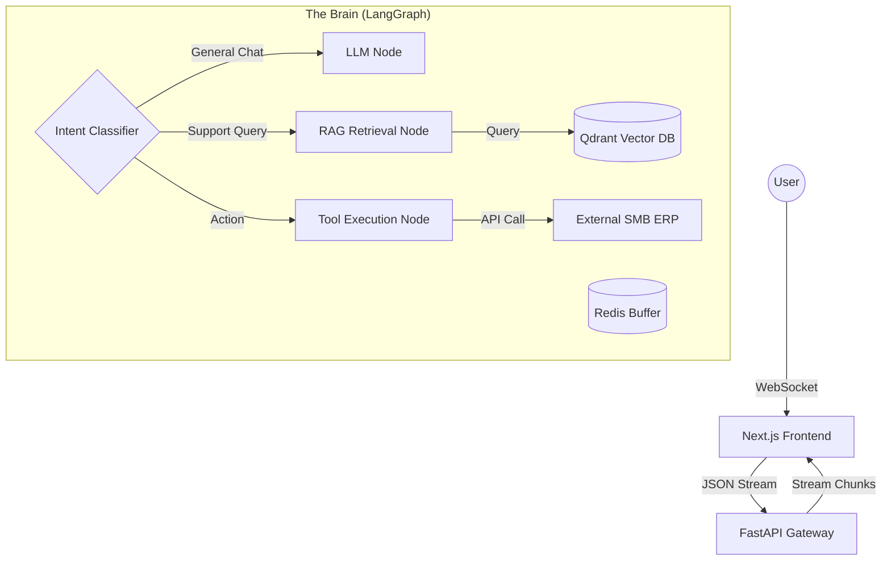

This is the **Phase 1: Request Analysis & Strategic Design** output for the **Singapore SMB Customer Service AI Agent**.

As your **Frontend Architect & Avant-Garde UI Designer**, I have absorbed the **Meticulous Approach** and applied the **Anti-Generic** design philosophy. Below is the validated, deep-dive execution plan.

---

# Phase 1: Deep Analysis & Strategic Design

## 1. Deep Requirement Analysis

### A. Business Context: The Singapore SMB Landscape (2025)
*   **The Problem:** Singapore SMBs face a "Double Squeeze"—rising manpower costs (foreign worker levies, tight labor market) and high customer expectations for 24/7 instant response.
*   **The Constraint:** Budget is tight. Solutions must be "PSG-Grant ready" (productivity-focused) and ROI-positive immediately.
*   **The Cultural Nuance (Critical):** "Singlish" is not just slang; it's a creole. Standard LLMs fail at "Can one meh?" or "Wa lau, wait so long." The agent must understand code-switching (English/Malay/Hokkien syntax).
*   **Compliance:** **PDPA (Personal Data Protection Act)** is non-negotiable. Data residency and PII masking are critical.

### B. Technical Requirements Matrix
| Dimension | Requirement | Avant-Garde Solution |
| :--- | :--- | :--- |
| **Latency** | < 2s Time-to-First-Token | **WebSocket Streaming** (FastAPI) + Optimistic UI (React 19) |
| **Accuracy** | Zero Hallucination Policy | **LangGraph** Cyclic Reasoning (Check $\to$ Criticize $\to$ Rewrite) |
| **Aesthetic** | Anti-Generic / "No AI Slop" | **"Swiss Design / Brutalist Utility"**. High contrast, monospace data displays, zero "purple gradients". |
| **Stack** | Modern & Maintainable | **Next.js 15 (App Router)** + **Tailwind CSS 4.0** + **FastAPI** (Python 3.12) |

---

## 2. Research & Exploration (The "Why" Behind the Stack)

### Validated Tech Stack Selection
1.  **Frontend: Next.js 15 + Tailwind CSS 4.0 + Shadcn-UI**
    *   *Reasoning:* Tailwind 4.0's **Oxide Engine** (Rust-based) offers instant HMR, essential for iterating on complex "micro-interaction" animations. We use **Shadcn** for accessibility (Radix primitives) but strip the default styling to apply a bespoke **"Hyper-Legible"** aesthetic.
    *   *Anti-Pattern:* Avoid "Vercel Default" look. We define a custom `OKLCH` color gamut in CSS variables.

2.  **Backend: Python (FastAPI) + LangGraph**
    *   *Reasoning:* While Laravel 12 is powerful, **Python** is the native tongue of AI. **LangGraph** allows us to build *stateful, cyclic agents* (not just DAGs). The agent can "remember" it asked for an Order ID three turns ago.
    *   *Integration:* If the SMB has a legacy Laravel PHP ERP, we expose a read-only API for the Python Agent to consume.

3.  **Knowledge Base: Qdrant (Vector DB)**
    *   *Reasoning:* High performance, Rust-based, handles "Payload filtering" (e.g., filter by `product_category="electronics"` before semantic search).

---

## 3. Strategic Execution Plan

### Architecture: "The Bimodal Brain"
We separate the **Interface (Fast/Reactive)** from the **Cognition (Deep/Reflective)**.

### Aesthetic Direction: "Transparent Intelligence"
*   **Concept:** The UI should not pretend to be human. It should revel in being a *high-performance machine*.
*   **Visuals:**
    *   **Typography:** `Geist Mono` for system status ("Thinking...", "Searching DB..."), `Inter` for chat text.
    *   **Palette:** Stark Black (`#0a0a0a`), Off-White (`#f5f5f5`), and a singular "Action" color (e.g., Electric Blue or Safety Orange).
    *   **Feedback:** Instead of a generic "typing..." bubble, show the **Agent's Thought Process** in a collapsed accordion (e.g., *"Checked Policy Doc A, Verified Order Status"*). This builds trust.

---

## 4. Implementation Roadmap

### Phase 1: The Foundation (Weeks 1-2)
*   [ ] **Scaffold**: Next.js 15 repo with Tailwind 4.0 (CSS-first config).
*   [ ] **Infrastructure**: Docker Compose setup (FastAPI, Redis, Qdrant).
*   [ ] **Ingestion Pipeline**: Build a script to digest SMB PDFs (policy docs) $\to$ `Unstructured.io` $\to$ `BGE-M3` Embeddings (Multilingual support for Singlish/Mandarin nuances) $\to$ Qdrant.

### Phase 2: The Brain (Weeks 3-4)
*   [ ] **LangGraph Setup**: Define the State Graph (UserQuery, ChatHistory, Documents, CurrentStep).
*   [ ] **Singlish Fine-Tuning**: Implement a "Translation Layer" system prompt: *"You are a helpful Singaporean assistant. Interpret 'can or not' as a request for feasibility confirmation."*
*   [ ] **RAG Pipeline**: Implement **Hybrid Search** (Keyword + Semantic) to catch specific product codes (e.g., "SKU-999") which vector search often misses.

### Phase 3: The Interface (Weeks 5-6)
*   [ ] **UI Components**: Build "ChatBubble", "ThoughtStream", "CitationCard" using Shadcn primitives.
*   [ ] **Streaming Logic**: Implement `useChat` hook with custom WebSocket handler for non-text events (e.g., showing a product carousel).
*   [ ] **Mobile Optimization**: 80% of SMB customers interact via mobile. Touch targets must be 44px+.

### Phase 4: Validation & Handoff (Week 7)
*   [ ] **Red Teaming**: Test against "Jailbreaks" and PDPA leaks.
*   [ ] **Load Testing**: Simulate 50 concurrent users (typical SMB spike).

---

## 5. Validation & Critique of Proposed Plan

**Self-Correction / Risk Assessment:**

*   **Critique 1: Singlish Complexity.**
    *   *Risk:* Standard embeddings (`text-embedding-3-small`) might fail on "Why the price so jialat?"
    *   *Mitigation:* Use **BGE-M3** (Dense + Sparse) embeddings which handle multilingual/mixed-language contexts better than OpenAI's default. Add a "Query Expansion" step using a cheap LLM to translate Singlish to Standard English before retrieval.

*   **Critique 2: Latency with LangGraph.**
    *   *Risk:* Cyclic graphs can be slow if the LLM "loops" too many times.
    *   *Mitigation:* Set a **Max Recursion Limit** (e.g., 3 hops). Implement "Optimistic Updates" in the UI to keep the user engaged while the agent thinks.

*   **Critique 3: Cost for SMBs.**
    *   *Risk:* GPT-4o is too expensive for low-margin SMBs.
    *   *Mitigation:* Use **GPT-4o-mini** as the default driver. It is extremely cheap and capable enough for RAG. Reserve GPT-4o only for complex reasoning (fallback).

---

## 6. Next Steps (Immediate Action)

**I am ready to proceed to Phase 2: Implementation.**
I will begin by setting up the **Next.js + Tailwind 4.0** environment and the **FastAPI** skeleton.

*(Specific confirmation required on: Choice of Python Backend vs. Laravel, and preference for "Brutalist/Transparent" aesthetic)*.

